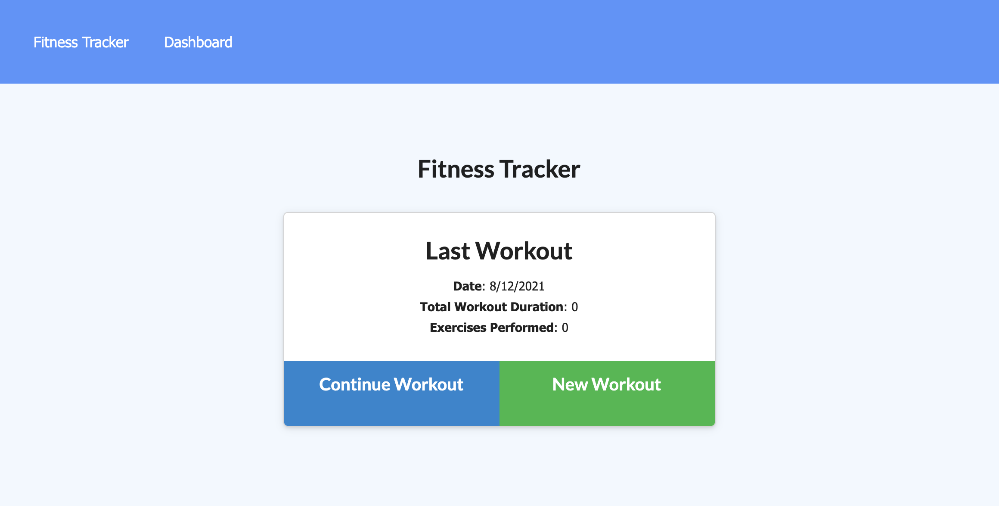
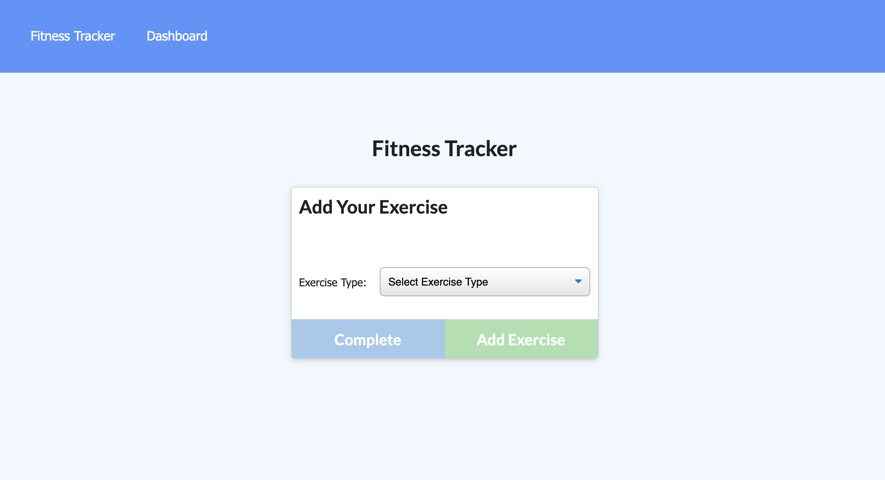
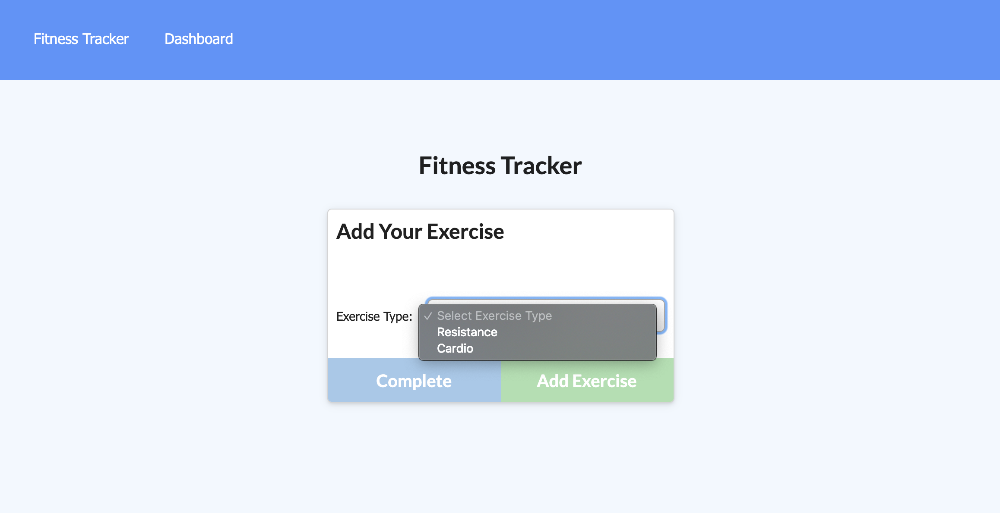
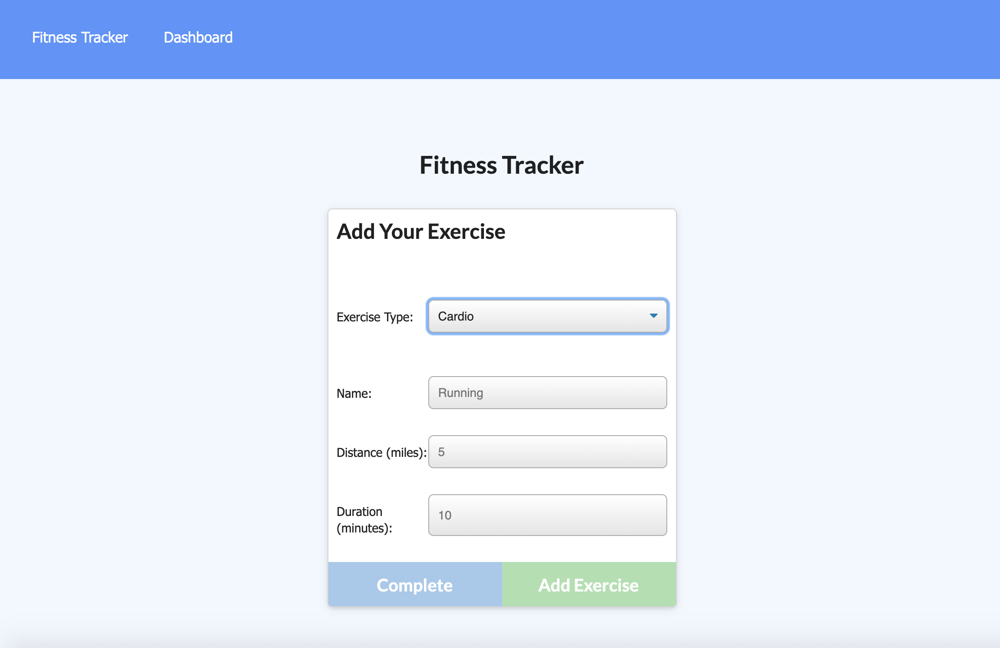
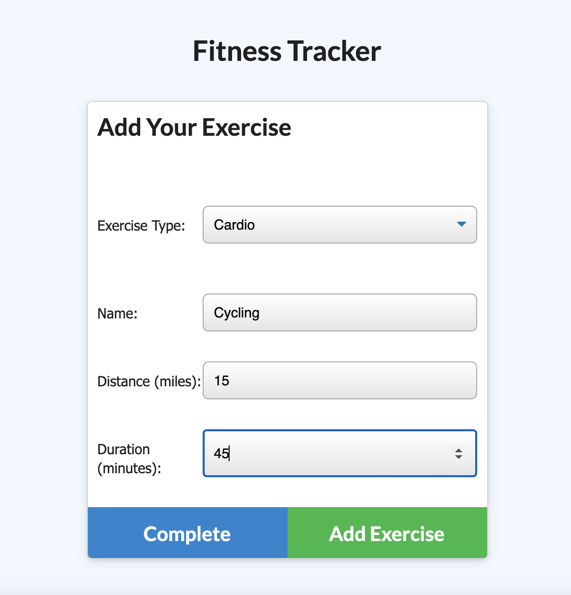
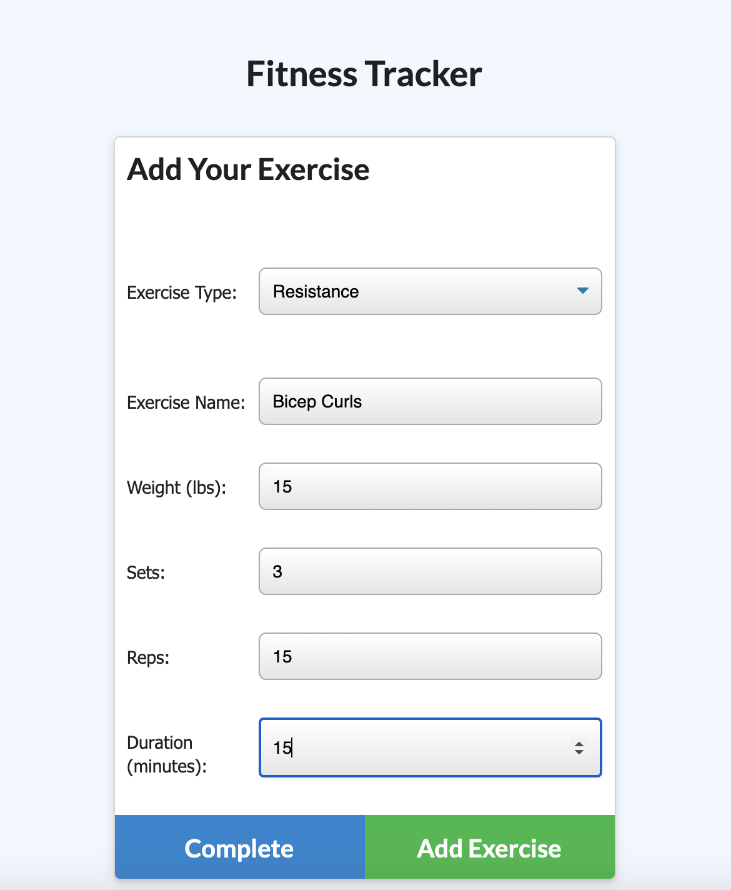
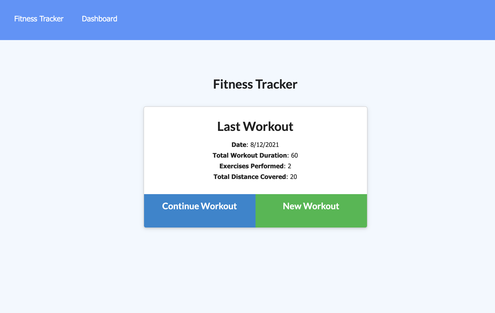
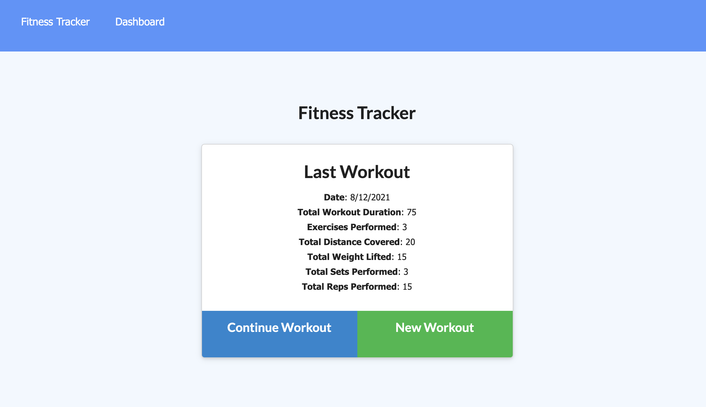
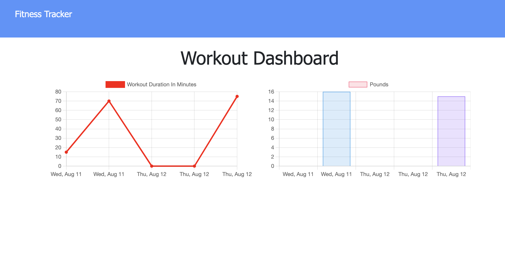

# Workout Tracker

### Table of Contents
- [Description](#Description)
- [Technologies Used](#Technologies-Used)
- [Installation](#installation)
- [Screenshots](#screenshots)
- [Sources](#sources)

## Description
This is an application that allows the user to input workouts (resistance and cardio). They can also track their exercise over a time period. On the dashboard, there is an overview of the workouts completed for the day. The Frontend was provided to me.

## Technologies Used
```
HTML JavaScript

CSS (Provided to me)

Node.JS
MongoDB
Express.JS
Mongoose
```
## Installation
To install the application, 
1. Fork the repository
2. Install all independcies using
```
npm install
```
3. Seed the provided database with the included data using
```node seeders/seed.js
```
4. Start the Server using
```
node server.js
```
5. Once the server is running, go to your web browser and view the application at http://localhost:3000/

## How to Use
This application is simple to use. The user can create a new workout or continue workout. Once on the new screen, the user can select the type of exercise (cardio or resistance). Depending on the type of exercise, certain information will be requested about the exercise. Fron there, they can complete the workout or add more. They can view the dashboard which provides an overview of the workouts.

## Screenshots
This is the initial screen that has the information about the last workout.


Once the user clicks a workout option, this page shows up where the user can pick the type of exercise.


Once they click on Exercise Type, the user can select Resistance or Cardio.


The buttons Continue Workout and New Workout are not active until information is added.


The Cardio option allows the user to type the name, distance, and duration. From there, they can click Complete which will take the user back to the main page or Add Exercise where another exercise can be added.


The Resistance option allows the user to type the name, weight, sets, reps, and duration. From there, the user can click Complete which will them them back to the main page or Add Exercise where another exercise can be added.



This is the view after two cardio workouts were added. 


This is the view after two cardio and one resistance workouts were added. Here, weights lifted, sets performed and reps performed are added.


This is the dashboard that shows workout duration and pounds lifted.


## Contributors
- Stephanie Davis

## Questions
If you have any questions, please feel free to contact me. 
- GitHub: [whatawhat](www.github.com/whatawhat) to visit my repository
- Email: stephedavis12@gmail.com

