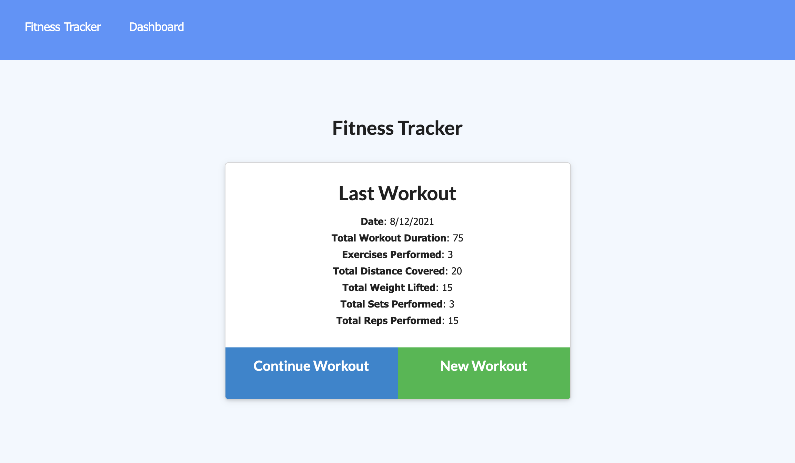
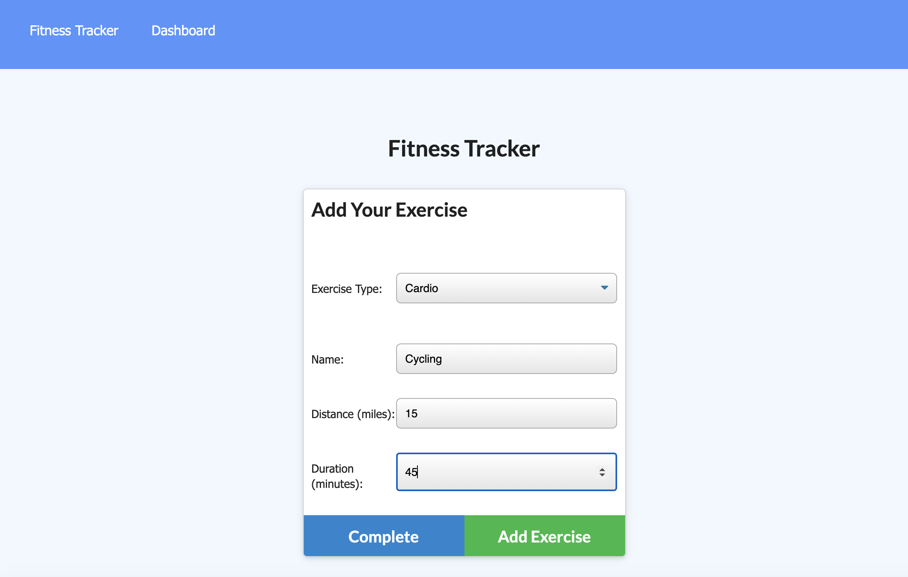

# Workout Tracker

### Table of Contents
- [Description](#Description)
- [Technologies Used](#Technologies-Used)
- [Installation](#installation)
- [Screenshots](#screenshots)
- [Sources](#sources)

## Description
This is an application that allows the user to input workouts (resistance and cardio). They can also track their exercise over a time period. On the dashboard, there is an overview of the workouts completed for the day. The Frontend was provided to me.

## Technologies Used
```
HTML JavaScript

CSS (Provided to me)

Node.JS
MongoDB
Express.JS
Mongoose
```
## Installation
To install the application, 
1. Fork the repository
2. Install all independcies using
```
npm install
```
3. Seed the provided database with the included data using
```node seeders/seed.js
```
4. Start the Server using
```
node server.js
```
5. Once the server is running, go to your web browser and view the application at http://localhost:3000/

## How to Use
This application is simple to use. The user can create a new workout or continue workout. Once on the new screen, the user can select the type of exercise (cardio or resistance). Depending on the type of exercise, certain information will be requested about the exercise. Fron there, they can complete the workout or add more. They can view the dashboard which provides an overview of the workouts.

## Screenshots
This is the initial screen that has the information about the last workout.


Once the user clicks New Workout, the Add Your Exercise page shows up with the option to select Resistance or Cardio.


This is the screen with the view of a previous search. This image shows the new styling.








## Contributors
- Stephanie Davis

## Questions
If you have any questions, please feel free to contact me. 
- GitHub: [whatawhat](www.github.com/whatawhat) to visit my repository
- Email: stephedavis12@gmail.com

